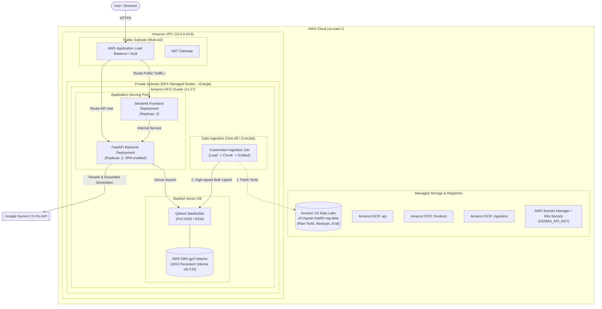

# Quran & Hadith RAG Assistant: 100% AWS Cloud Implementation Guide

A production-grade, end-to-end Retrieval-Augmented Generation (RAG) system for Islamic texts (Quran and Hadith), architected and deployed **entirely on AWS Cloud** using **Amazon EKS**, **Amazon EBS (gp3)**, **Amazon ECR**, **Amazon S3**, and **Terraform (IaC)** with automated CI/CD.

---

## 1. AWS Cloud Architecture Diagram



---

## 2. AWS Infrastructure Bill of Materials (BoM)

| AWS Service | Component Role | Configuration |
| :--- | :--- | :--- |
| **Amazon VPC** | Isolated Network | 2 Public Subnets, 2 Private Subnets, 1 NAT Gateway, Multi-AZ (`us-east-1a`, `us-east-1b`). |
| **Amazon EKS** | Container Orchestration | Kubernetes v1.27, Managed Node Group with `t3.large` instances (2 vCPU, 8GB RAM) to support sentence transformers and cross-encoders. |
| **AWS EBS (CSI)** | Persistent Storage for Qdrant | `gp3` StorageClass with EBS CSI Driver Addon (20Gi volume claim). |
| **Amazon ECR** | Container Image Registries | 2 repositories: `quran-hadith-rag-api` and `quran-hadith-rag-frontend`. |
| **Amazon S3** | Data Lake & Backup | Versioned bucket for caching raw Quran/Hadith JSONs, embeddings backup, and evaluation artifacts. |
| **Elastic Load Balancing** | Public Ingress | AWS Application Load Balancer (ALB) or Network Load Balancer (NLB) routing traffic to the frontend and API. |
| **IAM & Secrets** | Security & Auth | OIDC Provider for EKS, IRSA (IAM Roles for Service Accounts) for EBS CSI Driver and S3 access, Kubernetes Secrets for `GEMINI_API_KEY`. |

---

## 3. End-to-End Cloud Implementation Lifecycle (7 Stages)

---

### Stage 1: Terraform Infrastructure Provisioning

Update [infrastructure/terraform/main.tf](file:///c:/Users/shakeer/Desktop/quran-hadith-rag/infrastructure/terraform/main.tf) to provision the complete AWS stack:
1. **VPC with Public/Private Subnets and NAT Gateway**.
2. **EKS Cluster (v1.27)** with `t3.large` node groups (upgraded from `t3.medium` to avoid OOM with Hugging Face transformers).
3. **EBS CSI Driver EKS Add-on** + IRSA IAM role.
4. **ECR Repositories** for API and Frontend.
5. **S3 Bucket** for dataset caching.

#### Complete `infrastructure/terraform/main.tf`:
```hcl
terraform {
  required_version = ">= 1.3.0"
  required_providers {
    aws = {
      source  = "hashicorp/aws"
      version = "~> 5.0"
    }
  }
}

provider "aws" {
  region = var.aws_region
}

variable "aws_region" {
  default = "us-east-1"
}

variable "cluster_name" {
  default = "quran-hadith-rag-cluster"
}

# 1. VPC Configuration
module "vpc" {
  source  = "terraform-aws-modules/vpc/aws"
  version = "5.0.0"

  name = "${var.cluster_name}-vpc"
  cidr = "10.0.0.0/16"

  azs             = ["${var.aws_region}a", "${var.aws_region}b"]
  private_subnets = ["10.0.1.0/24", "10.0.2.0/24"]
  public_subnets  = ["10.0.101.0/24", "10.0.102.0/24"]

  enable_nat_gateway   = true
  single_nat_gateway   = true
  enable_dns_hostnames = true

  public_subnet_tags = {
    "kubernetes.io/role/elb"                      = "1"
    "kubernetes.io/cluster/${var.cluster_name}"   = "shared"
  }
  private_subnet_tags = {
    "kubernetes.io/role/internal-elb"             = "1"
    "kubernetes.io/cluster/${var.cluster_name}"   = "shared"
  }
}

# 2. S3 Bucket for Raw Datasets and Vector Snapshots
resource "aws_s3_bucket" "rag_data" {
  bucket_prefix = "quran-hadith-rag-data-"
  force_destroy = true
}

# 3. Amazon ECR Repositories
resource "aws_ecr_repository" "api_repo" {
  name                 = "quran-hadith-rag-api"
  image_tag_mutability = "MUTABLE"
  image_scanning_configuration {
    scan_on_push = true
  }
}

resource "aws_ecr_repository" "frontend_repo" {
  name                 = "quran-hadith-rag-frontend"
  image_tag_mutability = "MUTABLE"
  image_scanning_configuration {
    scan_on_push = true
  }
}

# 4. IAM Role for EBS CSI Driver (Required for Qdrant Persistent Storage)
module "ebs_csi_irsa_role" {
  source  = "terraform-aws-modules/iam/aws//modules/iam-role-for-service-accounts-eks"
  version = "~> 5.20"

  role_name             = "${var.cluster_name}-ebs-csi-role"
  attach_ebs_csi_policy = true

  oidc_providers = {
    ex = {
      provider_arn               = module.eks.oidc_provider_arn
      namespace_service_accounts = ["kube-system:ebs-csi-controller-sa"]
    }
  }
}

# 5. EKS Cluster
module "eks" {
  source  = "terraform-aws-modules/eks/aws"
  version = "~> 19.16"

  cluster_name    = var.cluster_name
  cluster_version = "1.27"

  cluster_endpoint_public_access  = true

  vpc_id                   = module.vpc.vpc_id
  subnet_ids               = module.vpc.private_subnets
  control_plane_subnet_ids = module.vpc.private_subnets

  # EBS CSI Driver Addon
  cluster_addons = {
    aws-ebs-csi-driver = {
      service_account_role_arn = module.ebs_csi_irsa_role.iam_role_arn
    }
    coredns    = { most_recent = true }
    kube-proxy = { most_recent = true }
    vpc-cni    = { most_recent = true }
  }

  eks_managed_node_groups = {
    primary_nodes = {
      min_size     = 1
      max_size     = 4
      desired_size = 2

      # Upgraded from t3.medium to t3.large (8GB RAM) for ML model inference
      instance_types = ["t3.large"]
      capacity_type  = "ON_DEMAND"
    }
  }
}

output "eks_cluster_name" {
  value = module.eks.cluster_name
}

output "ecr_api_url" {
  value = aws_ecr_repository.api_repo.repository_url
}

output "ecr_frontend_url" {
  value = aws_ecr_repository.frontend_repo.repository_url
}

output "s3_bucket_name" {
  value = aws_s3_bucket.rag_data.id
}
```

---

### Stage 2: Provision Infrastructure on AWS

Execute Terraform from your terminal:
```bash
cd infrastructure/terraform

# 1. Initialize Terraform plugins
terraform init

# 2. Preview the AWS resources
terraform plan -out=tfplan

# 3. Apply infrastructure
terraform apply tfplan

# 4. Connect kubectl to the newly provisioned AWS EKS Cluster
aws eks update-kubeconfig --name quran-hadith-rag-cluster --region us-east-1

# Verify nodes are ready
kubectl get nodes
```

---

### Stage 3: StorageClass & Qdrant StatefulSet on EKS

In AWS EKS, dynamic volume provisioning for Qdrant requires an EBS `gp3` StorageClass.

#### 3.1 Create StorageClass (`k8s/storageclass.yaml`)
```yaml
apiVersion: storage.k8s.io/v1
kind: StorageClass
metadata:
  name: ebs-gp3-sc
provisioner: ebs.csi.aws.com
volumeBindingMode: WaitForFirstConsumer
parameters:
  type: gp3
  encrypted: "true"
```
Apply StorageClass:
```bash
kubectl apply -f k8s/storageclass.yaml
```

#### 3.2 Update `k8s/qdrant.yaml` to use `ebs-gp3-sc`
```yaml
apiVersion: apps/v1
kind: StatefulSet
metadata:
  name: qdrant
  labels:
    app: qdrant
spec:
  serviceName: qdrant-svc
  replicas: 1
  selector:
    matchLabels:
      app: qdrant
  template:
    metadata:
      labels:
        app: qdrant
    spec:
      containers:
      - name: qdrant
        image: qdrant/qdrant:latest
        ports:
        - containerPort: 6333
          name: http
        - containerPort: 6334
          name: grpc
        resources:
          requests:
            cpu: "500m"
            memory: "1Gi"
          limits:
            cpu: "2"
            memory: "4Gi"
        volumeMounts:
        - name: qdrant-storage
          mountPath: /qdrant/storage
  volumeClaimTemplates:
  - metadata:
      name: qdrant-storage
    spec:
      accessModes: [ "ReadWriteOnce" ]
      storageClassName: ebs-gp3-sc
      resources:
        requests:
          storage: 20Gi
---
apiVersion: v1
kind: Service
metadata:
  name: qdrant-svc
spec:
  ports:
  - port: 6333
    targetPort: 6333
    name: http
  - port: 6334
    targetPort: 6334
    name: grpc
  clusterIP: None
  selector:
    app: qdrant
```
Apply Qdrant:
```bash
kubectl apply -f k8s/qdrant.yaml
# Verify pod is Running and bound to an EBS volume:
kubectl get pods -l app=qdrant
kubectl get pvc
```

---

### Stage 4: Build & Push Docker Images to Amazon ECR

#### 4.1 Authenticate Docker to Amazon ECR:
```bash
export AWS_REGION="us-east-1"
export AWS_ACCOUNT_ID=$(aws sts get-caller-identity --query Account --output text)

aws ecr get-login-password --region $AWS_REGION | docker login --username AWS --password-stdin $AWS_ACCOUNT_ID.dkr.ecr.$AWS_REGION.amazonaws.com
```

#### 4.2 Build & Push API Image:
```bash
docker build -t quran-hadith-rag-api:latest -f Dockerfile .
docker tag quran-hadith-rag-api:latest $AWS_ACCOUNT_ID.dkr.ecr.$AWS_REGION.amazonaws.com/quran-hadith-rag-api:latest
docker push $AWS_ACCOUNT_ID.dkr.ecr.$AWS_REGION.amazonaws.com/quran-hadith-rag-api:latest
```

#### 4.3 Build & Push Frontend Image:
```bash
docker build -t quran-hadith-rag-frontend:latest -f frontend/Dockerfile .
docker tag quran-hadith-rag-frontend:latest $AWS_ACCOUNT_ID.dkr.ecr.$AWS_REGION.amazonaws.com/quran-hadith-rag-frontend:latest
docker push $AWS_ACCOUNT_ID.dkr.ecr.$AWS_REGION.amazonaws.com/quran-hadith-rag-frontend:latest
```

---

### Stage 5: Cloud-Native Data Ingestion on EKS (Kubernetes Job)

Instead of ingesting 6,236 Quran verses and Hadiths over your local network, run the ingestion **directly inside the AWS EKS cluster** as a Kubernetes Job. It talks directly to `qdrant-svc:6333` on the private pod network at gigabit speeds.

#### Create `k8s/ingest-job.yaml`:
```yaml
apiVersion: batch/v1
kind: Job
metadata:
  name: quran-hadith-ingestion-job
spec:
  backoffLimit: 2
  template:
    spec:
      restartPolicy: OnFailure
      containers:
      - name: ingest
        image: <AWS_ACCOUNT_ID>.dkr.ecr.us-east-1.amazonaws.com/quran-hadith-rag-api:latest
        command: ["python", "ingest.py"]
        env:
        - name: QDRANT_HOST
          value: "qdrant-svc"
        - name: QDRANT_PORT
          value: "6333"
        resources:
          requests:
            cpu: "1000m"
            memory: "2Gi"
          limits:
            cpu: "2000m"
            memory: "4Gi"
```

Run Ingestion in EKS:
```bash
kubectl apply -f k8s/ingest-job.yaml

# Follow real-time ingestion logs inside AWS:
kubectl logs -f job/quran-hadith-ingestion-job
```

---

### Stage 6: Deploy API & Interactive Web Frontend on EKS

#### 6.1 Store Gemini API Key as Kubernetes Secret:
```bash
kubectl create secret generic llm-secrets \
  --from-literal=gemini_api_key="YOUR_ACTUAL_GEMINI_API_KEY"
```

#### 6.2 Deploy FastAPI Backend (`k8s/api.yaml`):
```yaml
apiVersion: apps/v1
kind: Deployment
metadata:
  name: api-deployment
  labels:
    app: api
spec:
  replicas: 2
  selector:
    matchLabels:
      app: api
  template:
    metadata:
      labels:
        app: api
    spec:
      containers:
      - name: api
        image: <AWS_ACCOUNT_ID>.dkr.ecr.us-east-1.amazonaws.com/quran-hadith-rag-api:latest
        imagePullPolicy: Always
        ports:
        - containerPort: 8000
        env:
        - name: QDRANT_HOST
          value: "qdrant-svc"
        - name: QDRANT_PORT
          value: "6333"
        - name: GEMINI_API_KEY
          valueFrom:
            secretKeyRef:
              name: llm-secrets
              key: gemini_api_key
        resources:
          requests:
            cpu: "500m"
            memory: "1.5Gi"
          limits:
            cpu: "2"
            memory: "3Gi"
---
apiVersion: v1
kind: Service
metadata:
  name: api-svc
spec:
  type: ClusterIP
  ports:
  - port: 8000
    targetPort: 8000
  selector:
    app: api
```

#### 6.3 Deploy Frontend UI (`k8s/frontend.yaml`):
```yaml
apiVersion: apps/v1
kind: Deployment
metadata:
  name: frontend-deployment
  labels:
    app: frontend
spec:
  replicas: 2
  selector:
    matchLabels:
      app: frontend
  template:
    metadata:
      labels:
        app: frontend
    spec:
      containers:
      - name: frontend
        image: <AWS_ACCOUNT_ID>.dkr.ecr.us-east-1.amazonaws.com/quran-hadith-rag-frontend:latest
        imagePullPolicy: Always
        ports:
        - containerPort: 8501
        env:
        - name: API_URL
          value: "http://api-svc:8000"
        resources:
          requests:
            cpu: "250m"
            memory: "512Mi"
          limits:
            cpu: "1"
            memory: "1Gi"
---
apiVersion: v1
kind: Service
metadata:
  name: frontend-svc
  annotations:
    service.beta.kubernetes.io/aws-load-balancer-type: "external"
    service.beta.kubernetes.io/aws-load-balancer-nlb-target-type: "instance"
    service.beta.kubernetes.io/aws-load-balancer-scheme: "internet-facing"
spec:
  type: LoadBalancer
  ports:
  - port: 80
    targetPort: 8501
  selector:
    app: frontend
```

Apply Workloads:
```bash
kubectl apply -f k8s/api.yaml
kubectl apply -f k8s/frontend.yaml

# Check pods and get AWS Load Balancer URL:
kubectl get pods
kubectl get svc frontend-svc
```

The output of `kubectl get svc frontend-svc` will give you an **AWS External-IP URL** (e.g., `k8s-frontend-xxxx.elb.us-east-1.amazonaws.com`) that you can open directly in your browser.

---

### Stage 7: Automated CI/CD Deployment with GitHub Actions

Update [.github/workflows/deploy.yaml](file:///c:/Users/shakeer/Desktop/quran-hadith-rag/.github/workflows/deploy.yaml) to automate the entire testing, container build, and deployment process to AWS on every git push:

```yaml
name: AWS Cloud CI/CD Pipeline

on:
  push:
    branches: [ main ]

jobs:
  test-and-eval:
    runs-on: ubuntu-latest
    steps:
    - uses: actions/checkout@v3
    - name: Set up Python
      uses: actions/setup-python@v4
      with:
        python-version: '3.10'
    - name: Install dependencies
      run: |
        python -m pip install --upgrade pip
        pip install -r requirements.txt
    - name: Run Tests
      run: pytest tests/ -v

  build-and-deploy:
    needs: test-and-eval
    runs-on: ubuntu-latest
    steps:
    - uses: actions/checkout@v3
    
    - name: Configure AWS credentials
      uses: aws-actions/configure-aws-credentials@v2
      with:
        aws-access-key-id: ${{ secrets.AWS_ACCESS_KEY_ID }}
        aws-secret-access-key: ${{ secrets.AWS_SECRET_ACCESS_KEY }}
        aws-region: us-east-1

    - name: Login to Amazon ECR
      id: login-ecr
      uses: aws-actions/amazon-ecr-login@v1

    - name: Build, tag, and push images
      env:
        ECR_REGISTRY: ${{ steps.login-ecr.outputs.registry }}
        IMAGE_TAG: ${{ github.sha }}
      run: |
        # API Image
        docker build -t $ECR_REGISTRY/quran-hadith-rag-api:$IMAGE_TAG -t $ECR_REGISTRY/quran-hadith-rag-api:latest .
        docker push $ECR_REGISTRY/quran-hadith-rag-api:$IMAGE_TAG
        docker push $ECR_REGISTRY/quran-hadith-rag-api:latest

        # Frontend Image
        docker build -t $ECR_REGISTRY/quran-hadith-rag-frontend:$IMAGE_TAG -t $ECR_REGISTRY/quran-hadith-rag-frontend:latest -f frontend/Dockerfile .
        docker push $ECR_REGISTRY/quran-hadith-rag-frontend:$IMAGE_TAG
        docker push $ECR_REGISTRY/quran-hadith-rag-frontend:latest

    - name: Deploy to Amazon EKS
      run: |
        aws eks update-kubeconfig --name quran-hadith-rag-cluster --region us-east-1
        kubectl apply -f k8s/storageclass.yaml
        kubectl apply -f k8s/qdrant.yaml
        kubectl apply -f k8s/api.yaml
        kubectl apply -f k8s/frontend.yaml
        kubectl rollout restart deployment/api-deployment
        kubectl rollout restart deployment/frontend-deployment
```

---

## 4. Summary of AWS Cloud Commands (Cheatsheet)

```bash
# 1. Provision Infrastructure
cd infrastructure/terraform
terraform init && terraform apply -auto-approve

# 2. Configure kubectl
aws eks update-kubeconfig --name quran-hadith-rag-cluster --region us-east-1

# 3. Apply Storage & Secrets
kubectl apply -f k8s/storageclass.yaml
kubectl apply -f k8s/qdrant.yaml
kubectl create secret generic llm-secrets --from-literal=gemini_api_key="$GEMINI_API_KEY"

# 4. Trigger In-Cluster Ingestion Job
kubectl apply -f k8s/ingest-job.yaml
kubectl logs -f job/quran-hadith-ingestion-job

# 5. Deploy API & Frontend
kubectl apply -f k8s/api.yaml
kubectl apply -f k8s/frontend.yaml

# 6. View Public App URL
kubectl get svc frontend-svc -o jsonpath='{.status.loadBalancer.ingress[0].hostname}'
```
