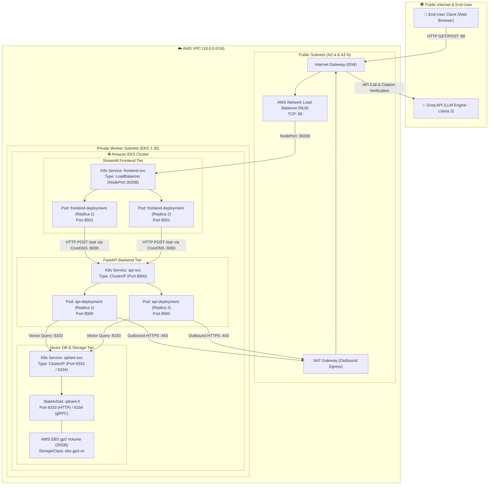

# 📖 aain.ai is a Quran & Hadith RAG Assistant

> A production-grade Retrieval-Augmented Generation (RAG) assistant for Islamic texts (Quran and Hadith), built with hybrid search, reranking, and strict citation verification to prevent hallucinations on sacred texts.

<!-- 
  PLACEHOLDER: Add a banner/hero screenshot of your app here.
  Example: 
-->


<p align="center">
  
  
  
  
  
</p>

---

## ✨ Overview

This project is an end-to-end RAG pipeline purpose-built for religious texts, where accuracy and verifiability matter more than anywhere else. It combines dense embeddings with sparse BM25 retrieval, cross-encoder reranking, and a strict citation-checking layer so that every answer traces back to a real, verifiable source in the Quran or Hadith collections — never a hallucinated one.

The system is fully containerized and deployable on AWS EKS via Terraform and Kubernetes manifests, following modern MLOps practices from ingestion to evaluation.

---

## 🖼️ Screenshots / Demo

<!-- 
  PLACEHOLDER: Paste your screenshots or a demo GIF below.
  Example:
  
  
-->

| | |
|---|---|
|  |  |
|  |  |

---

## 🚀 Features

- **📥 Data Ingestion** — Automated loading and chunking of Quranic verses and Hadiths
- **🔍 Hybrid Search** — Dense embeddings + BM25 sparse retrieval powered by Qdrant
- **📊 Reranking** — Cross-encoder reranking for improved retrieval accuracy
- **✅ Verifiable Generation** — Strict prompting and citation checking to prevent hallucinations on sacred texts
- **📈 Evaluation** — RAGAS-based metrics for retrieval quality and faithfulness
- **⚙️ MLOps-Ready** — Dockerized application with Terraform infrastructure for AWS EKS deployment
- **☸️ Kubernetes Native** — Ships with production-ready K8s manifests

---

## 🏗️ Architecture & Network Flow

```
User Query → Frontend (Streamlit) → API (FastAPI) → Hybrid Retrieval (Qdrant + BM25)
           → Reranker (Cross-Encoder) → LLM Generation (Groq API / Llama 3)
           → Citation Verification → Verified Response
```

### 🌐 End-User & Internal Cluster Network Flow



### 🔄 Traffic Path Breakdown

#### 1. 🌐 External Ingress (End-User to Frontend)
1. **User Request**: The user navigates to the public NLB DNS address (`http://<nlb-dns>.elb.ap-south-1.amazonaws.com`) on port `80`.
2. **AWS Ingress Routing**: Traffic hits the **AWS Internet Gateway (IGW)** and is forwarded to the **AWS Network Load Balancer (NLB)** provisioned across public subnets in multi-AZ (`ap-south-1a`, `ap-south-1b`).
3. **NodePort Dispatch**: The NLB routes the TCP traffic directly to target EC2 worker nodes on assigned NodePort `30208`.
4. **Kube-Proxy Routing**: The in-cluster `kube-proxy` maps traffic from the `frontend-svc` abstraction to healthy `frontend-deployment` Streamlit pods running on container port `8501`.

#### 2. ⚡ Internal Microservice Flow (Frontend to API)
1. **Service Discovery**: The Streamlit frontend discovers the backend through in-cluster CoreDNS at `http://api-svc:8000`.
2. **API Invocation**: Streamlit dispatches an HTTP POST request to `/ask` with user query payload and parameters (`top_k`, `verify_citations`).
3. **ClusterIP Load Balancing**: The `api-svc` `ClusterIP` balances traffic evenly across active, healthy `api-deployment` pods.

#### 3. 🔍 Data Retrieval & Embedding Engine
1. **Local Query Vectorization**: The `api` pod passes the query to an in-process SentenceTransformer model to compute dense vector embeddings.
2. **Vector DB Query**: The API queries the vector database through internal DNS `http://qdrant-svc:6333` using Qdrant's Universal Query API (`query_points`).
3. **Storage Persistence**: The `qdrant-0` StatefulSet retrieves points from its attached AWS EBS gp3 volume (`/qdrant/storage`), dynamically mounted via AWS EBS CSI driver.
4. **Local Reranking**: Candidate passages (Quranic ayahs and authentic hadiths) are scored and reranked using an in-process Cross-Encoder (`cross-encoder/ms-marco-MiniLM-L-6-v2`).

#### 4. 🔒 Outbound Egress (API to LLM & Verification)
1. **Secure NAT Egress**: The backend constructs an exact prompt enforcing strict grounding and reaches out to the Groq API over HTTPS (`443`).
2. **NAT Gateway Routing**: Traffic from private worker subnets routes through the VPC's AWS NAT Gateway to the Internet Gateway.
3. **Hallucination Verification**: The Llama 3 model returns generated candidate claims, followed by an automated citation verification check.
4. **Final Response**: The JSON response is routed back through the internal stack to the user's browser, displaying verified Arabic text, English translations, and citation badges.

---

## 📂 Project Structure

```
quran-hadith-rag/
├── api/                        # FastAPI endpoints
├── data/                       # Raw and processed source texts
├── ingestion/                  # Data loaders, chunkers, and embedders
├── retrieval/                  # Vector store management, hybrid retrieval, reranking
├── llm/                        # Prompts and LLM generation logic
├── verification/               # Citation checking and hallucination prevention
├── evaluation/                 # RAGAS evaluation suite
├── infrastructure/terraform/   # Terraform scripts for EKS
├── k8s/                        # Kubernetes deployment manifests
├── frontend/                   # Frontend application
├── tests/                      # Test suite
├── Dockerfile
├── ingest.py
└── requirements.txt
```

---

## 🛠️ Tech Stack

| Layer | Technology |
|---|---|
| Vector Store | Qdrant (hybrid: dense + BM25) |
| Reranking | Cross-Encoder |
| API | FastAPI |
| Evaluation | RAGAS |
| Containerization | Docker |
| Infrastructure | Terraform (AWS EKS) |
| Orchestration | Kubernetes |

---

## ⚡ Getting Started

### Prerequisites
- Python 3.10+
- Docker (optional, for containerized deployment)
- AWS account (optional, for EKS deployment)

### Installation

```bash
# Clone the repository
git clone https://github.com/shakeer7/quran-hadith-rag.git
cd quran-hadith-rag

# Create a virtual environment
python -m venv venv

# Activate it
# Windows:
venv\Scripts\activate
# Linux/Mac:
source venv/bin/activate

# Install dependencies
pip install -r requirements.txt
```

### Ingest the data

```bash
python ingest.py
```

### Run the API

```bash
uvicorn api.main:app --reload
```

### Run with Docker

```bash
docker build -t quran-hadith-rag .
docker run -p 8000:8000 quran-hadith-rag
```

### Deploy to AWS EKS

```bash
cd infrastructure/terraform
terraform init
terraform apply

kubectl apply -f k8s/
```

---

## 🧪 Evaluation

This project uses **RAGAS** to measure retrieval and generation quality:

```bash
pytest evaluation/
```

<!-- PLACEHOLDER: Add a screenshot of your evaluation results/dashboard here -->


---

## 🙏 A Note on Accuracy

Working with the Quran and Hadith demands a higher bar than typical RAG applications. This system is designed to:
- Never generate content not grounded in retrieved source text
- Flag low-confidence or unverifiable citations
- Prefer refusing to answer over guessing

That said, this tool is an aid for research and study — always verify important religious rulings with a qualified scholar.

---

## 🗺️ Roadmap

- [ ] Multi-language support (Arabic, Urdu, English)
- [ ] Tafsir (exegesis) integration
- [ ] Chain-of-custody citation scoring
- [ ] Public web demo

---

## 🤝 Contributing

Contributions, issues, and feature requests are welcome. Feel free to check the [issues page](https://github.com/shakeer7/quran-hadith-rag/issues).

## 📄 License

This project is licensed under the MIT License.

## 👤 Author

**Shakeer**
GitHub: [@shakeer7](https://github.com/shakeer7)
